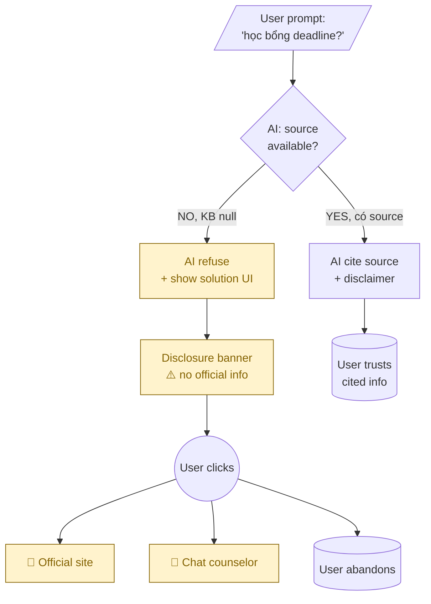

# 🎨 Prompt 5b — Mermaid UI Flow (Layer 3 UI interaction)

**Khi dùng**: Day 25 Solution Design Phase B (sau khi pick option UI-first)
**Layer**: 3 — UI Response (multi-screen flow)
**Tool recommended**: Claude / ChatGPT / Gemini
**Output save vào**: `worksheet/02-solution-design/artifact/{1-uiux|3-architecture}/demo.md`
**Time budget**: 5-10 phút

---

## Khi nào dùng prompt này

Khi solution involves **multiple screens hoặc states** (user → AI → action button → next screen), Mermaid flowchart visualize interaction flow tốt hơn ASCII.

Alternative cho Prompt 5a — chọn 1 trong 2 (hoặc cả 2 nếu có thời gian).

---

## PROMPT (paste sau 00-context.md)

```
# REQUEST — Generate Mermaid UI flow diagram (chỉ Mermaid, KHÔNG ASCII)

## Background

Tôi đang design solution ở Layer 3 UI cho failure case:
[Paste case ID + summary từ §6]

ASCII sketch tôi đã gen ở prompt riêng (nếu có). Đây tôi cần interaction 
flow giữa multiple screens hoặc states.

## Solution flow to map

- **Entry point**: 
  [User submit prompt with failure trigger]
  
- **Decision points**: 
  [AI detect failure mode, decide refuse/escalate/cite]
  
- **Action paths**: 
  [3 paths user có thể đi sau khi AI response]
  
- **Exit points**: 
  [User outcomes — resolved / escalated / abandoned]

## Request

Generate Mermaid flowchart (KHÔNG ASCII):

### Constraints
- **Mermaid type**: `flowchart TD` (top-down) — natural cho UI flow
- **Node types**:
  - `[text]` rectangle — for screens/states
  - `{text}` diamond — for AI decision points
  - `((text))` circle — for user actions
  - `[/text/]` parallelogram — for input/output
- **Edge labels**: action verbs ("clicks", "submits", "views")
- **Max nodes**: 8-10 (nếu nhiều hơn → tách sub-flows)
- **Color/style**: dùng `classDef` để highlight solution-related nodes 
  (red/orange) vs default

### Pattern to follow

1. Entry node: User action (top)
2. AI processing node (rectangle or diamond)
3. Decision diamond: failure detected? yes/no
4. Branch paths: success / failure / escalation
5. UI states user navigates
6. Exit nodes: outcomes

### Output structure example



### Iteration

Gen v1 trước. Sau đó tôi sẽ feedback:
- "Add sub-flow cho path X"
- "Simplify — bỏ node Y vì redundant"
- "Color path Z differently"

## Anti-patterns AVOID

❌ ASCII art trong Mermaid (mất point của Mermaid)
✅ Pure Mermaid syntax — render bằng GitHub/Notion natively

❌ Quá nhiều nodes (>15) — không readable
✅ Max 8-10 nodes, tách sub-flows nếu cần

❌ Edge labels generic ("goes to", "then")
✅ Action verbs ("clicks", "submits", "verifies")

❌ ASCII output mixed với Mermaid
✅ Pure Mermaid only, render-ready
```

---

## ✅ Review checklist

- [ ] Max 8-10 nodes? (Nếu hơn → tách sub-flow)
- [ ] Entry point (user) + Exit points (outcomes) rõ ràng
- [ ] Decision diamonds có YES/NO branches đầy đủ
- [ ] Solution nodes được highlight (classDef)
- [ ] Edge labels là action verbs

## 🔄 Render Mermaid

Test render trong:
- **GitHub README**: paste ```mermaid block, GitHub render tự động
- **Notion**: Slash command `/mermaid` rồi paste
- **Live editor**: [mermaid.live](https://mermaid.live) preview real-time
- **VS Code**: extension "Markdown Preview Mermaid Support"

→ Nếu render lỗi, đưa back vào AI: "Fix syntax error in this Mermaid"
