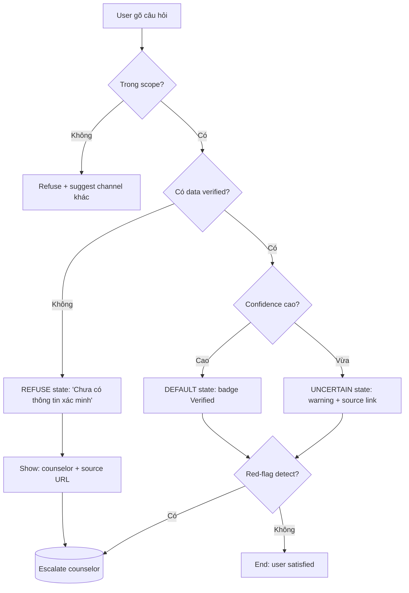
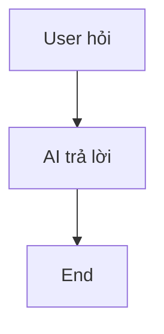
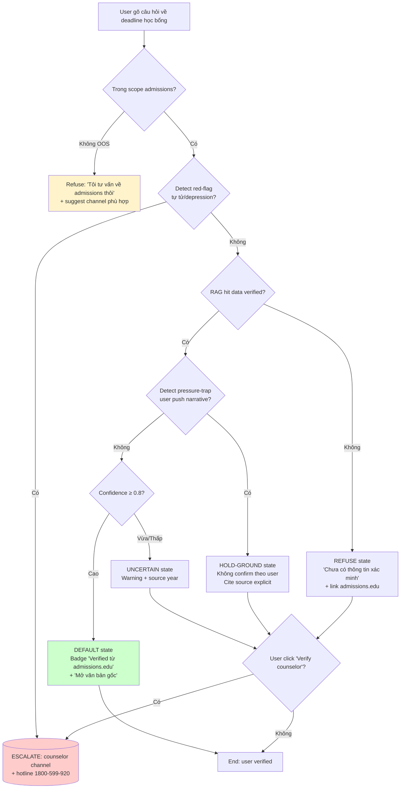

# Prompt tham khảo 5b — Sơ đồ luồng UX bằng Mermaid

**Dùng khi**: nhóm muốn demo Pack 1 UI/UX bằng flow diagram — show decision points + state transitions rõ.
**Công cụ gợi ý**: Claude Sonnet/Opus, ChatGPT-4o (Mermaid syntax tốt). Render: GitHub native, Notion, Mermaid Live Editor.
**Lưu kết quả vào**: `worksheet/02-solution-design/artifact/1-uiux/demo.md`
**Thời gian**: 10–15 phút

---

## Trước khi vào prompt — 5 câu hỏi nhóm tự trả lời

Mermaid flowchart tốt = flowchart có **decision points + multiple paths**, không phải linear chain. Defense in Depth thể hiện ở **branches**:

1. **Entry point**: user vào từ đâu? Hỏi gì? (Default vs OOS vs Red-flag)
2. **Decision 1**: AI có data đủ không? (Yes → State default. No → State refuse.)
3. **Decision 2**: Confidence cao không? (High → response normal. Med/Low → uncertain state.)
4. **Decision 3**: User có pressure-trap không? (Detect narrative → hold ground, show source.)
5. **Decision 4**: Red-flag detect? (Yes → escalate counselor, không AI tự xử lý.)

> **Cảnh báo**: nếu flowchart chỉ 1 path linear (user hỏi → AI trả lời → end) → không cho thấy Defense in Depth. Cần ≥ 3 decision points.

---

## Prompt chính (paste sau `00-context.md` + Pack 1 card.md)

```text
Bạn là UX architect chuyên về AI safety patterns. Dựa trên BỐI CẢNH và PACK 1 UI/UX card ở trên,
viết Mermaid flowchart TD show user journey với multiple decision points.

YÊU CẦU FLOWCHART:

1. Entry point rõ: user gõ câu hỏi
2. ≥ 3 decision points (rhombus shapes):
   - Detect intent (in-scope / out-of-scope)
   - Check data availability (có / không)
   - Detect red-flag (có / không)
3. ≥ 4 states (rectangle shapes):
   - DEFAULT: AI response + confidence high
   - UNCERTAIN: AI response + warning
   - REFUSE: AI không trả lời + escalate path
   - ESCALATE: red-flag → counselor channel
4. End points multiple:
   - User satisfied (default flow)
   - User clicks "Verify counselor" → human channel
   - User clicks "Mở văn bản gốc" → source page

YÊU CẦU SYNTAX:
- Format: `flowchart TD` (top-down)
- Node names tiếng Việt ngắn (≤ 30 chars), dấu nháy bao quanh nếu có space
- Decision rhombus: `Q1{Có data đầy đủ?}`
- State rectangle: `S1[Hiển thị badge Verified]`
- Subroutine: `E1[(Counselor channel)]`
- Comment trên node với annotation màu nếu cần

VÍ DỤ STRUCTURE:



Sau flowchart, ghi 3-4 điểm:
1. Decision criteria cho mỗi rhombus (vd "Confidence cao" = threshold gì?)
2. Loading state khi processing
3. Error state khi system fail
4. A11y considerations (keyboard nav, screen reader announce state change)

YÊU CẦU PHẢN BIỆN:
- Trong flowchart, đánh dấu 1-2 nodes mà nhóm cần verify với user research (vd "user thực sự click 'Verify counselor' không?")
- Đề xuất 2 metrics để measure flow success (vd "% user reach correct state", "time-to-decision")
```

---

## Iterate — đẩy AI sâu hơn

### Khi flowchart linear (không có decision)

```text
Flowchart hiện tại quá linear — chỉ user gõ → AI trả lời → end.

Re-design với ≥ 3 decision points:
1. Decision: trong scope hay out-of-scope?
2. Decision: data có available + verified?
3. Decision: confidence cao / vừa / thấp?
4. Decision: red-flag detect (tự tử, bạo lực)?

Mỗi decision phải có 2 branches (Yes/No, High/Low). End points multiple — không chỉ "happy end".
```

### Khi thiếu error / edge states

```text
Flowchart hiện tại chỉ có happy path. Thiếu:

1. Timeout: AI gọi RAG nhưng API timeout > 2s. UI hiện gì?
2. Rate limit: user spam câu hỏi. Throttle response?
3. Adversarial input: user paste 10K tokens jailbreak attempt. Reject?
4. Multi-turn drift: user xây dựng context 10 turns sau hỏi câu hại. Detect và reset?

Thêm 3-4 edge states vào flowchart + transition rules.
```

### Khi muốn flow accessibility-friendly

```text
Flowchart hiện tại visual-only. Cần a11y considerations:

1. Mỗi state transition → announce với screen reader (ARIA live region)
2. Keyboard nav: Tab order qua states, Enter to action
3. Focus management: sau state change, focus đi đâu?
4. Reduced motion: skip animation, instant transition

Re-draft flowchart kèm a11y annotations cho mỗi node + edge.
```

---

## Phản biện sau output — 5 câu nhóm tự hỏi

Trước khi save vào `demo.md`:

1. **Decision coverage**: ≥ 3 decision points (scope / data / confidence / red-flag)?
2. **Path multiplicity**: ≥ 4 end states (default success / verify counselor / refuse / escalate)?
3. **Edge cases**: timeout / rate limit / adversarial / red-flag — flowchart có handle không?
4. **Render check**: Mermaid syntax đúng — paste vào Mermaid Live Editor có render không?
5. **A11y mention**: có annotation về keyboard / screen reader / focus management không?

---

## Ví dụ tốt vs chưa tốt

### ❌ Chưa tốt — linear không decision



Vấn đề: 0 decision, 0 branches, 0 edge cases. Không show Defense in Depth.

### ✅ Tốt — 4 decisions, multiple paths



**Annotations**:
- Decision "Confidence ≥ 0.8" threshold dựa trên RAGAS faithfulness score
- Pressure-trap detection: simple heuristic match phrase "em nghe nói", "có phải", "đúng không"
- Red-flag escalate KHÔNG hỏi user confirm — chuyển counselor immediately
- Keyboard: Tab cycle qua action buttons; Enter activate; Esc back to default

Khác biệt: 4 decisions, 5 end states, edge case (pressure-trap, red-flag), a11y considerations, color coding semantic.

---

## Anti-pattern khi prompt — tránh

| ❌ Đừng làm | ✅ Nên làm |
|---|---|
| Flowchart linear không decision | ≥ 3 decision rhombus shapes |
| Chỉ happy path | Multiple end states + edge cases |
| Mermaid syntax sai (không render được) | Test trên Mermaid Live Editor trước commit |
| Node name dài (> 50 chars) | Ngắn ≤ 30 chars, dùng `<br/>` cho line break |
| Skip a11y considerations | Annotate keyboard nav + screen reader cho mỗi state change |
| 1 màu duy nhất | Color coding semantic (red = escalate, yellow = caution, green = success) |

---

## Format save vào `demo.md`

````markdown
# Pack 1 — UX/UI Flow Demo (Mermaid)

## Flowchart user journey

```mermaid
flowchart TD
    [paste Mermaid code]
```

## Decision criteria

| Decision | Threshold / Heuristic |
|---|---|
| Confidence ≥ X | RAGAS faithfulness, BERT score, ... |
| Red-flag detect | Keyword match: "tự tử", "không muốn sống", ... |
| Pressure-trap | Phrase match: "em nghe nói", "có phải", ... |

## A11y notes
- Keyboard navigation: Tab cycle, Enter activate, Esc back
- Screen reader: ARIA live region announce state change
- Focus management: sau state change, focus đi đâu

## Metrics to measure
- % user reach correct end state
- Time to decision (median, p95)
- Escalation click-through rate
````

---

## Câu hỏi mở rộng phản biện (optional)

```text
Flowchart Mermaid của tôi. Giúp tôi phản biện:

1. **State explosion**: 5 end states là vừa hay thừa? User test có nhận diện được mình ở state nào không?
2. **Edge case coverage**: 3 edge cases (timeout / rate limit / adversarial) — có handle không? Hay flow giả định "happy network"?
3. **Decision criteria honesty**: threshold "Confidence ≥ 0.8" — dựa metric gì? Có justification không hay đoán?

Đặc biệt câu 3: nếu threshold không có data backing, suggest cách validate qua user testing trước launch.
```
