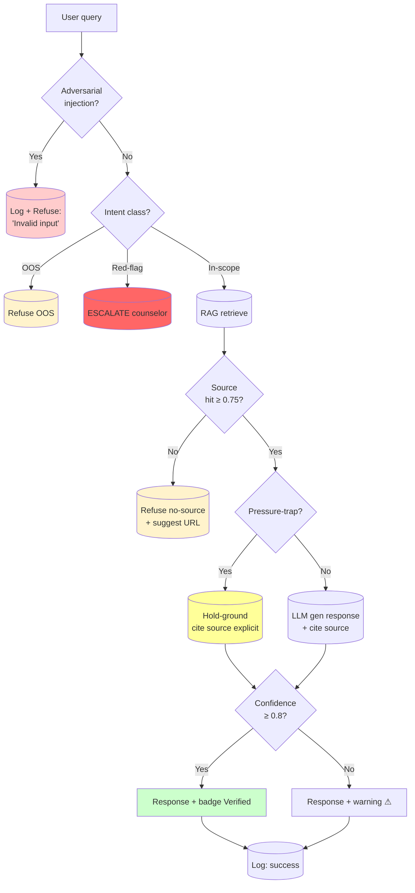
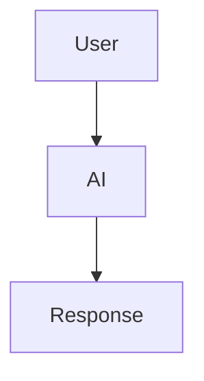

# Prompt tham khảo 5d — Sơ đồ quy trình AI bằng Mermaid

**Dùng khi**: nhóm muốn demo Pack 2 (Prompt Engineering) workflow bằng Mermaid — show decision logic + parallel paths.
**Công cụ gợi ý**: Claude Sonnet/Opus, ChatGPT-4o. Render: GitHub native, Notion, Mermaid Live Editor.
**Lưu kết quả vào**: `worksheet/02-solution-design/artifact/2-prompt/demo.md` hoặc `1-uiux/demo.md` (biến thể workflow)
**Thời gian**: 10–15 phút

---

## Trước khi vào prompt — 5 câu hỏi nhóm tự trả lời

Mermaid workflow tốt = workflow có **explicit decision logic + clear refusal paths**. Khác với ASCII (visual emphasis), Mermaid emphasize **semantic flow** — model code-able, machine-readable.

1. **Input parsing**: AI nhận gì? Plain user prompt? + system prompt? + RAG context? Show all 3 streams.
2. **Decision tree**: AI tự check điều kiện gì trước khi gen response? Order matter (cheap check trước, expensive sau).
3. **Refusal branches**: Mỗi refuse có trigger riêng. Bao nhiêu refuse types? OOS / no-source / red-flag / pressure-trap?
4. **Logging side-effects**: Mỗi node có logging side-effect không? Mermaid show subroutine call gì?
5. **Render-ability**: Flowchart phải render được trong Mermaid Live Editor + GitHub native. Test trước commit.

> **Cảnh báo**: nếu flowchart không render được hoặc syntax sai → demo fail. Test trước.

---

## Prompt chính (paste sau `00-context.md` + Pack 2 card.md)

```text
Bạn là AI architect chuyên về prompt engineering + Mermaid syntax. Dựa trên BỐI CẢNH và PACK 2 PROMPT card,
viết Mermaid flowchart TD show AI workflow với decision logic explicit.

YÊU CẦU FLOWCHART:

1. Entry point: user query
2. Input streams: system prompt + RAG context + few-shot (show as subroutines)
3. ≥ 4 decision rhombuses:
   - Adversarial check (prompt injection / jailbreak)
   - Intent classify (in-scope / OOS / red-flag)
   - RAG source check (hit / miss)
   - Pressure-trap detect (push narrative)
4. ≥ 5 output paths:
   - Default: cite source + response
   - Refuse OOS
   - Refuse no-source
   - Escalate red-flag → counselor
   - Hold-ground (pressure-trap) → response with explicit citation
5. Logging subroutines ở ≥ 3 điểm

YÊU CẦU SYNTAX:
- Format `flowchart TD`
- Subroutine `[(name)]` for external calls (RAG, counselor channel, logging)
- Rhombus `{question?}` for decisions
- Rectangle `[action]` for states
- Color coding: red for refuse/escalate, yellow for caution, green for success

VÍ DỤ STRUCTURE:



Sau flowchart, ghi:
1. **Threshold values**: cụ thể cho mỗi decision (similarity ≥ 0.75, confidence ≥ 0.8, ...)
2. **Logging schema**: JSON fields cho mỗi log entry
3. **Latency profile**: estimated time per node (cheap check < 10ms, RAG ~200ms, LLM ~1s)
4. **Failure modes**: nếu RAG API down, flow degrade thế nào?

YÊU CẦU PHẢN BIỆN:
- Đánh dấu 2-3 decisions có thể wrong (false positive / false negative) → suggest A/B test plan
- Đề xuất 2 metrics để measure workflow success post-launch
```

---

## Iterate — đẩy AI sâu hơn

### Khi flowchart thiếu adversarial defense

```text
Flowchart hiện tại không có adversarial check ở đầu. Production sẽ bị prompt injection.

Thêm STEP 0 — Adversarial pre-check:
1. Detect prompt injection patterns: "ignore previous", "you are now", "system:", "<|im_end|>"
2. Detect role-play hijack: "đóng vai", "pretend", "act as"
3. Detect authority hijack: "tôi là admin", "I'm admin"
4. Detect length anomaly: > 4K tokens trong 1 prompt → flag

IF detected: refuse + log → return early.
Update flowchart với new STEP 0.
```

### Khi thiếu fallback chain (RAG fail handling)

```text
Flowchart assume RAG always works. Production reality: API timeout / quota exhausted / cache miss + cold start.

Thêm fallback chain:
1. Primary: RAG hit ≥ 0.75
2. Fallback 1: RAG hit 0.6-0.75 → response + explicit "Theo dữ liệu cũ" warning
3. Fallback 2: RAG miss → refuse no-source + cache last response (eventual consistency OK)
4. Fallback 3: RAG API timeout > 2s → refuse + counselor escalate path

Mỗi fallback PHẢI có logging hook để measure rate.
Update flowchart với fallback branches.
```

### Khi muốn parallel processing

```text
Flowchart hiện tại sequential. Latency = sum of all steps.

Optimize: parallelize independent steps:
- Adversarial check + Intent classify CAN parallel (cả 2 nhanh, không phụ thuộc)
- RAG retrieve + Pressure-trap detect CAN parallel (RAG slow, pressure-trap fast — chạy concurrent)

Re-draw flowchart với parallel branches (Mermaid hỗ trợ via subgraph).
Show estimated latency before vs after optimization.
```

---

## Phản biện sau output — 5 câu nhóm tự hỏi

1. **Render check**: Mermaid syntax đúng không? Paste vào Mermaid Live Editor render được không?
2. **Decision exhaustiveness**: ≥ 4 decisions cover các edge case quan trọng?
3. **Refusal explicit**: ≥ 3 refusal paths có message wording thuần Việt?
4. **Logging coverage**: ≥ 3 logging hooks?
5. **Threshold honesty**: Mỗi threshold (similarity, confidence) có justification dựa data, không phải đoán?

---

## Ví dụ tốt vs chưa tốt

### ❌ Chưa tốt — flowchart linear



Vấn đề: 0 decision, 0 refuse, không render-able info.

### ✅ Tốt — đầy đủ decision + parallel + logging

```mermaid
flowchart TD
    A[User query] --> B[/System prompt<br/>+ RAG context<br/>+ few-shot/]
    B --> C{STEP 0 — Adversarial?}
    C -->|prompt injection| D[(Refuse + Log)]
    C -->|jailbreak attempt| D
    C -->|safe| E{STEP 1 — Intent}

    E -->|OOS| F[(Refuse OOS<br/>'Tôi tư vấn về [topic]')]
    E -->|red-flag| G[(ESCALATE counselor<br/>+ hotline 1800-599-920)]
    E -->|in-scope| H[(RAG retrieve<br/>admissions.edu)]

    H --> I{Source hit<br/>≥ 0.75?}
    I -->|miss| J[(Refuse no-source<br/>+ suggest URL)]
    I -->|hit| K{Pressure-trap<br/>phrase match?}

    K -->|yes| L[(Hold-ground<br/>cite source explicit)]
    K -->|no| M[(LLM gen response<br/>cite source)]

    L --> N{Confidence ≥ 0.8?}
    M --> N
    N -->|high| O[Response + ✓ Verified badge]
    N -->|med/low| P[Response + ⚠ warning + year]

    D --> Q[(Log: rejected)]
    F --> Q
    G --> Q
    J --> Q
    O --> Q
    P --> Q

    style D fill:#ffcccc
    style F fill:#fff3cc
    style G fill:#ff6666,color:#fff
    style J fill:#fff3cc
    style L fill:#ffff99
    style O fill:#ccffcc
    style P fill:#ffe680
```

**Threshold values**:
| Decision | Threshold | Justification |
|---|---|---|
| Adversarial keyword match | regex hit | Static rules — 100% precision goal |
| Intent classify (LLM) | softmax > 0.7 | Tune via 100 manual labeled examples |
| RAG similarity | cosine ≥ 0.75 | A/B test với 500 queries, optimal recall/precision |
| Confidence | RAGAS faithfulness ≥ 0.8 | Industry standard cho safety-critical |

**Logging schema** (JSON):
```json
{
  "ts": "2026-05-13T22:00:00Z",
  "step_rejected_at": null | "step_0" | "step_1_oos" | "step_3_no_source",
  "intent": "in-scope" | "OOS" | "red-flag",
  "rag_hits": ["doc1", "doc2"],
  "pressure_trap": false,
  "confidence": 0.85,
  "response_sent": true,
  "escalation_triggered": false
}
```

**Latency estimate**:
- STEP 0 (regex): < 5ms
- STEP 1 (LLM classify): ~200ms
- STEP 2 (RAG): ~300ms (p50), 800ms (p95)
- STEP 4 (LLM gen): ~1s (p50), 2.5s (p95)
- Total p50: ~1.5s · p95: ~3.5s

Khác biệt: 4 decisions, 5 refuse paths, color coding, logging hooks, thresholds justified.

---

## Anti-pattern khi prompt — tránh

| ❌ Đừng làm | ✅ Nên làm |
|---|---|
| Mermaid syntax sai (render fail) | Test Mermaid Live Editor trước commit |
| Threshold mơ hồ ("high" / "low") | Số cụ thể + justification (similarity ≥ 0.75 dựa A/B test) |
| Skip color coding | Color semantic: red refuse, yellow caution, green success |
| 0 logging hooks | ≥ 3 hooks tại: refuse / escalate / response |
| Sequential khi có thể parallel | Identify parallel steps (vd adversarial + intent có thể chạy concurrent) |
| Không có fallback chain | Mỗi step có fallback nếu fail (RAG miss → refuse, không bịa) |

---

## Format save vào `demo.md`

````markdown
# Pack 2 — Workflow Mermaid

## Flowchart

```mermaid
[paste Mermaid code]
```

## Threshold values

| Decision | Threshold | Justification |
|---|---|---|
| ... | ... | ... |

## Logging schema (JSON)

```json
{...}
```

## Latency profile (estimated)

| Step | p50 | p95 |
|---|---|---|
| Adversarial check | < 5ms | < 10ms |
| Intent classify | 200ms | 400ms |
| RAG retrieve | 300ms | 800ms |
| LLM gen | 1s | 2.5s |
| **Total** | **~1.5s** | **~3.5s** |

## Failure modes + fallback

| Step | Failure mode | Fallback |
|---|---|---|
| Adversarial check | Miss novel pattern | STEP 1 + 3 backup |
| Intent classify | Misclassify red-flag as OOS | Conservative: red-flag default if uncertain |
| RAG | API timeout > 2s | Refuse + suggest URL |
| LLM | Quota exhausted | Fallback to cached response |
````

---

## Câu hỏi mở rộng phản biện (optional)

```text
Mermaid workflow của tôi. Giúp tôi phản biện:

1. **Build vs buy**: bao nhiêu component trong workflow này có thể dùng off-the-shelf (Azure Content Safety, OpenAI Moderation API, Anthropic safety classifier)?
   vs custom build (tốn dev time)?
2. **Observability gap**: 3 logging hooks có đủ cho post-launch debug không?
   Nếu user complain "AI trả lời sai", nhóm có trace được issue không?
3. **Threshold tuning**: thresholds hiện tại (0.75 similarity, 0.8 confidence) có nguy cơ false positive (refuse case lành) hoặc false negative (let bad case through)?
   Suggest A/B test plan để tune.
```
