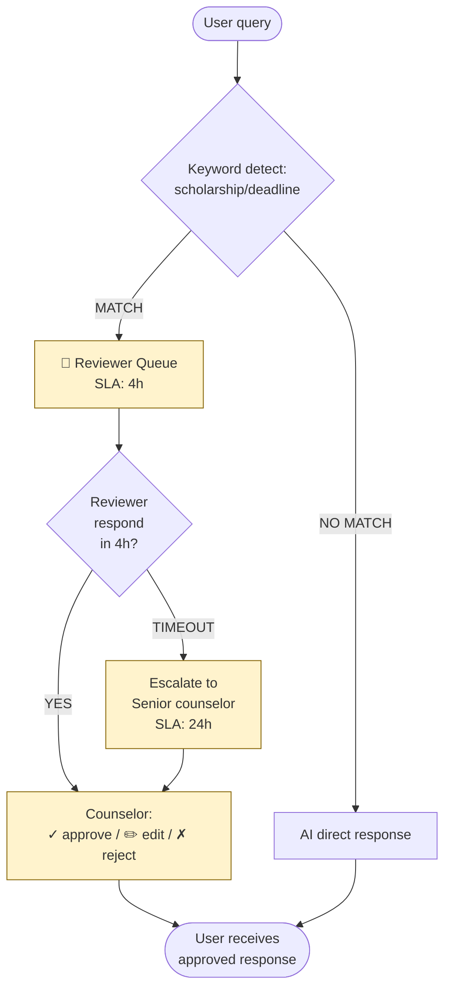

# 🔀 Prompt 5d — Mermaid Workflow (Layer 4 Human-in-loop)

**Khi dùng**: Day 25 Solution Design Phase B (sau khi pick option Process-first)
**Layer**: 4 — Human-in-the-loop
**Tool recommended**: Claude / ChatGPT / Gemini
**Output save vào**: `worksheet/02-solution-design/artifact/{1-uiux|3-architecture}/demo.md`
**Time budget**: 5-10 phút

---

## Khi nào dùng prompt này

Khi cần render workflow trong GitHub/Notion natively, hoặc cần share với team engineer (Mermaid render đẹp + version-control friendly).

Alternative cho Prompt 5c — chọn 1 trong 2 (hoặc cả 2).

---

## PROMPT (paste sau 00-context.md)

```
# REQUEST — Generate Mermaid workflow (chỉ Mermaid, KHÔNG ASCII)

## Background

Tôi đang design solution ở Layer 4 Human-in-the-loop cho failure case:
[Paste case ID + summary từ §6]

Cần Mermaid flowchart để render natively trong GitHub/Notion.

## Workflow to map

- **Trigger**: 
  [Paste — Keyword / classifier / user request]
  
- **Process steps**: 
  [Paste — Detection / Routing / Review / Decision / Delivery]
  
- **SLA**: 
  [Paste — Review SLA, escalation timing]
  
- **Edge cases**: 
  [Paste — Timeout, after-hours, reviewer offline]

## Request

Generate Mermaid flowchart (KHÔNG ASCII):

### Constraints
- **Mermaid type**: `flowchart TD` (top-down)
- **Node types**:
  - `[text]` rectangle — for action steps
  - `{text}` diamond — for decision points
  - `((text))` circle — for events
  - `[\text\]` trapezoid — for SLA constraints
- **Edge labels**: 1-2 words action ("approved", "rejected", "timeout")
- **Max 10 nodes** total
- **Color/style**: highlight reviewer paths với `classDef`

### Pattern to follow

1. Entry: User query (top)
2. Detection: keyword/classifier
3. Routing decision
4. Reviewer queue + SLA box
5. Decision: approve/edit/reject
6. Edge cases: timeout, after-hours
7. Exit: user receives response

### Output structure example



### Iteration

Gen v1 trước. Sau đó tôi sẽ feedback:
- "Add audit log node cho mỗi reviewer decision"
- "Show retry escalation tree"
- "Sub-flow cho weekend handling"

## Anti-patterns AVOID

❌ ASCII art trong Mermaid
✅ Pure Mermaid syntax

❌ Edge labels generic
✅ Action verbs ("approved", "timeout", "escalated")

❌ SLA không trong box
✅ SLA inline trong reviewer/escalation node
```

---

## ✅ Review checklist

- [ ] Top-down direction (TD)
- [ ] Decision diamonds có YES/NO/TIMEOUT branches
- [ ] SLA inline trong reviewer/escalation node
- [ ] classDef highlight reviewer-related nodes
- [ ] Max 10 nodes

## 🔄 Render & Validate

Test render:
- [mermaid.live](https://mermaid.live) — preview real-time
- GitHub: paste ```mermaid block
- Notion: `/mermaid` slash command

Nếu render error, paste vào AI: "Fix Mermaid syntax error in this diagram"

## 💡 Tip — Combo với ASCII

Nếu có thời gian, gen cả ASCII (5c) + Mermaid (5d):
- ASCII cho presentation slide / printed handout
- Mermaid cho documentation / GitHub README

Save cả 2 vào `worksheet/02-solution-design/artifact/[pack]/`:
- `ascii-sketch.md`
- `mermaid-diagram.md`
