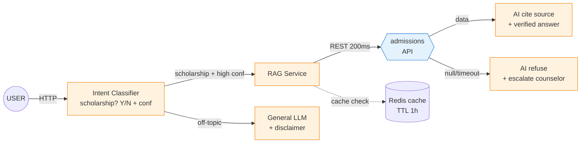

# 🏗️ Prompt 5f — Mermaid Architecture (Layer 1 Input)

**Khi dùng**: Day 25 Solution Design Phase B (sau khi pick option Tech-first)
**Layer**: 1 — Input / RAG / Data
**Tool recommended**: Claude / ChatGPT / Gemini
**Output save vào**: `worksheet/02-solution-design/artifact/{1-uiux|3-architecture}/demo.md`
**Time budget**: 5-10 phút

---

## Khi nào dùng prompt này

Cần Mermaid version cho:
- Render trong GitHub/Notion natively
- Share với team engineer (Mermaid version-control friendly)
- Embed vào documentation

Alternative cho Prompt 5e — chọn 1 trong 2 (hoặc cả 2).

---

## PROMPT (paste sau 00-context.md)

```
# REQUEST — Generate Mermaid architecture (chỉ Mermaid, KHÔNG ASCII)

## Background

Tôi đang design solution ở Layer 1 Input / RAG cho failure case:
[Paste case ID + summary từ §6]

Cần Mermaid version để render trong GitHub/Notion + share với team engineer.

## Architecture to map

- **External dependencies**: 
  [Paste — APIs, databases]
  
- **Internal components**: 
  [Paste — classifier, RAG service, orchestrator]
  
- **Data flow**: 
  [Paste — user → classifier → RAG → API → response]
  
- **Failure paths**: 
  [Paste — timeout, null, low confidence]
  
- **Fallback**: 
  [Paste — refuse + escalate when uncertain]

## Request

Generate Mermaid flowchart (KHÔNG ASCII):

### Constraints
- **Mermaid type**: `flowchart LR` (left-right) cho architecture flow
- **Node types**:
  - `[text]` rectangle — internal services
  - `[(text)]` cylinder — for databases
  - `{{text}}` hexagon — for external APIs
  - `{text}` diamond — for decisions/routers
  - `((text))` circle — for users/clients
- **Edge labels**: protocol/SLA ("HTTP 200ms", "REST", "gRPC")
- **Max 10 nodes** total
- **Color/style**: external services một màu, internal khác màu

### Pattern to follow

1. **Entry**: User/Client (left)
2. **Service layer**: classifier, orchestrator
3. **External services**: APIs, databases
4. **Decision/Router**
5. **Output paths**: success / failure / fallback

### Output structure example



### Iteration

Gen v1 trước. Sau đó tôi sẽ feedback:
- "Add monitoring layer"
- "Show retry path với exponential backoff"
- "Sub-architecture cho cache invalidation"

## Anti-patterns AVOID

❌ ASCII trong Mermaid
✅ Pure Mermaid syntax

❌ Generic edge labels
✅ Protocol + SLA inline ("HTTP 200ms", "REST sync", "gRPC")

❌ External và internal không phân biệt visually
✅ classDef cho rõ ràng external vs internal
```

---

## ✅ Review checklist

- [ ] Left-right direction (LR) cho architecture
- [ ] Node types đúng (rectangle/cylinder/hexagon/diamond)
- [ ] Edge labels có protocol + SLA
- [ ] classDef phân biệt external vs internal
- [ ] Max 10 nodes

## 🔄 Render & Validate

Test render:
- [mermaid.live](https://mermaid.live) — preview real-time
- GitHub: paste ```mermaid block
- Notion: `/mermaid` slash command
- Excalidraw: import Mermaid code

Nếu syntax error, paste vào AI: "Fix Mermaid syntax in this diagram"

## 💡 Tip — Embed vào doc

Sau khi có Mermaid architecture:

1. **GitHub README**: Mermaid render auto
2. **Notion**: Embed natively với `/mermaid`
3. **Confluence**: install Mermaid macro
4. **Google Docs**: dùng add-on "Mermaid for Docs"
5. **PDF export**: render Mermaid → screenshot → embed image

→ Share với team engineer dễ.

## 🔄 Combo với ASCII

Nếu thời gian dư, gen cả ASCII (5e) + Mermaid (5f):
- ASCII cho presentation slide / printed handout (offline-friendly)
- Mermaid cho documentation / GitHub README (version-control friendly)

Save vào:
- `worksheet/02-solution-design/artifact/{1-uiux|3-architecture}/demo.md`
- `worksheet/02-solution-design/artifact/{1-uiux|3-architecture}/demo.md`
