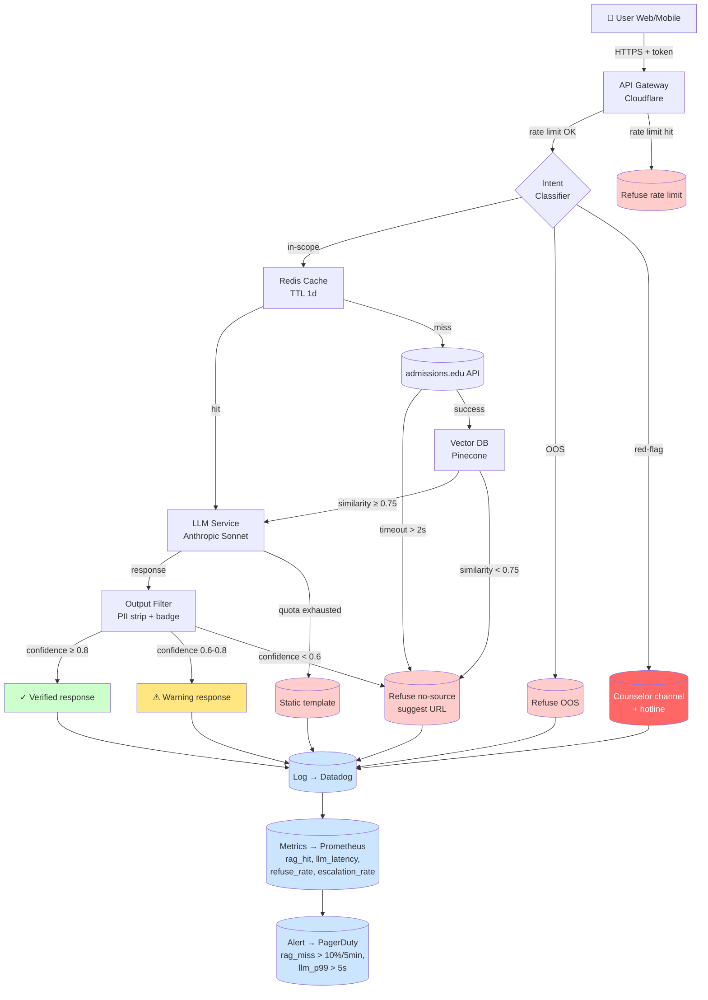
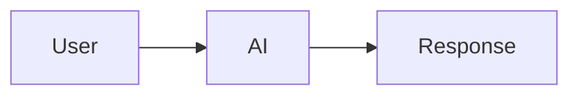
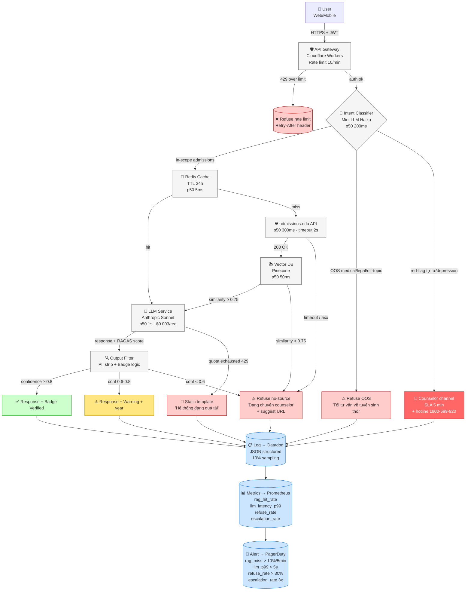

# Prompt tham khảo 5f — Sơ đồ kiến trúc dữ liệu bằng Mermaid

**Dùng khi**: nhóm muốn demo Pack 3 (Architecture / RAG) bằng Mermaid — semantic, code-able, GitHub native render.
**Công cụ gợi ý**: Claude Sonnet/Opus, ChatGPT-4o. Render: GitHub native, Notion, Mermaid Live Editor.
**Lưu kết quả vào**: `worksheet/02-solution-design/artifact/3-architecture/demo.md`
**Thời gian**: 10–15 phút

---

## Trước khi vào prompt — 5 câu hỏi nhóm tự trả lời

Mermaid architecture diagram tốt = diagram code-able, **dev đọc xong build được**:

1. **Components**: bao nhiêu services? Loại gì (API, DB, cache, LLM, classifier, gateway, monitor)?
2. **Data flow**: arrows direction rõ. Sync vs async? Request/response vs pub/sub?
3. **External dependencies**: vendor nào (Anthropic, Pinecone, Cloudflare, Datadog)? Risk lock-in?
4. **Fallback chain**: primary → fallback 1 → fallback 2. Mỗi step có condition rõ.
5. **Observability**: metrics, logs, alerts — show as subroutines, không bỏ.

> **Cảnh báo**: Mermaid render fail nếu syntax sai. Test trên Mermaid Live Editor trước commit.

---

## Prompt chính (paste sau `00-context.md` + Pack 3 card.md)

```text
Bạn là backend architect chuyên về RAG systems + AI safety. Dựa trên BỐI CẢNH và PACK 3 ARCHITECTURE card,
viết Mermaid diagram show full data flow với fallback + observability.

YÊU CẦU DIAGRAM:

1. Format: `flowchart TD` hoặc `graph LR` (chọn theo readability)
2. ≥ 6 components:
   - API Gateway (rate limit + auth)
   - Intent Classifier
   - Cache layer (Redis)
   - Vector DB (Pinecone / Weaviate / pgvector)
   - External API (data source chính)
   - LLM Service
   - Output Filter (PII + badge)
   - Monitoring stack (logs + metrics + alerts)

3. ≥ 3 fallback paths (show as edges với label điều kiện):
   - Cache miss → API call
   - API timeout > 2s → refuse no-source
   - LLM quota → static template

4. Observability hooks ở ≥ 3 components (show as subroutines):
   - `[(Log → Datadog)]`
   - `[(Metric → Prometheus)]`
   - `[(Alert → PagerDuty)]`

5. Color coding:
   - 🟢 Green: success path
   - 🟡 Yellow: warning/uncertain
   - 🔴 Red: refuse/escalate
   - 🔵 Blue: observability

VÍ DỤ STRUCTURE:



VỚI MỖI COMPONENT, ghi:
- **Vendor / tech choice** (Cloudflare, Anthropic, Pinecone, Redis, Datadog)
- **Latency p50/p95**
- **Cost per req hoặc per 1M**
- **Failure mode + fallback**

YÊU CẦU PHẢN BIỆN:
- Identify ≥ 1 SPOF + mitigation
- Estimate cost cho 1M users × 5 query/day
- Suggest 3 SLO targets (availability, latency, accuracy)
```

---

## Iterate — đẩy AI sâu hơn

### Khi diagram thiếu vendor specifics

```text
Diagram hiện tại generic ("API", "LLM"). Production cần specific vendor choices:

1. API Gateway: AWS API Gateway / Cloudflare Workers / Google Cloud Endpoints?
2. LLM: Anthropic Sonnet / OpenAI GPT-4o / Gemini 1.5 Pro? Pros/cons từng cái cho use case?
3. Vector DB: Pinecone / Weaviate / pgvector / Qdrant? Latency vs cost tradeoff?
4. Cache: Redis / Memcached / Cloudflare KV? TTL strategy khác nhau?
5. Monitoring: Datadog / Grafana + Prometheus / New Relic? Cost vs feature?

Re-draw với specific vendors + justify mỗi choice (latency, cost, integration ease, lock-in risk).
```

### Khi thiếu data privacy considerations (PII)

```text
Diagram hiện tại không address PII handling. NĐ 13/2023 (VN data protection) yêu cầu:

1. **Encryption at rest**: vector DB embeddings có chứa PII? Encrypt với KMS?
2. **Encryption in transit**: TLS 1.3 minimum giữa services?
3. **Data residency**: data lưu ở VN hay overseas? GDPR equivalent compliance?
4. **PII redaction**: user input có PII (số CMND, email) → strip trước khi log?
5. **Audit trail**: 7 năm retention cho legal compliance?
6. **Right to be forgotten**: user request xoá data — workflow xử lý thế nào?

Re-draw với PII compliance layer (encryption, redaction, audit) + show data residency.
```

### Khi muốn scale architecture cho 10M users

```text
Diagram hiện tại OK cho 1M users. Scale 10M cần:

1. **Horizontal scaling**: API Gateway và LLM Service load-balanced N instances
2. **Sharding**: Vector DB shard by department / year / track
3. **Read replicas**: admissions.edu API replicate ở multiple regions
4. **CDN caching**: static responses cache tại edge (Cloudflare)
5. **Queue + async**: red-flag escalation → SQS/Kafka queue + worker pool
6. **Circuit breaker**: nếu downstream fail rate > threshold, short-circuit để protect

Re-draw với scale-out architecture. Show capacity planning numbers.
```

---

## Phản biện sau output — 5 câu nhóm tự hỏi

1. **Render check**: Mermaid syntax đúng — paste vào Mermaid Live Editor render đẹp không?
2. **Component count**: ≥ 6 components + ≥ 3 data sources + ≥ 3 observability nodes?
3. **Fallback chain**: ≥ 3 fallback paths với trigger condition rõ?
4. **Vendor specific**: choices có justified (Anthropic vs OpenAI? Pinecone vs Weaviate?)?
5. **PII / Compliance**: NĐ 13/2023 considerations có address không?

---

## Ví dụ tốt vs chưa tốt

### ❌ Chưa tốt — diagram linear không fallback



Vấn đề: 1 component, 0 fallback, 0 observability.

### ✅ Tốt — full architecture



**Vendor choices + justification**:

| Layer | Vendor | Why | Alternative |
|---|---|---|---|
| Gateway | Cloudflare Workers | Edge latency, built-in rate limit, DDoS | AWS API Gateway (higher latency) |
| Intent Classifier | Anthropic Haiku | Cheap, fast, good for VN | OpenAI GPT-4o-mini |
| Vector DB | Pinecone | Managed, fast | Self-host Weaviate (cost ↓ ops ↑) |
| Cache | Redis | Sub-10ms, mature | Cloudflare KV (eventual consistency issue) |
| LLM | Anthropic Sonnet | Best safety on VN, reasonable cost | OpenAI GPT-4o (better tooling) |
| Monitoring | Datadog | Comprehensive, expensive | Grafana + Prom (more ops) |

**Cost estimate** (1M users × 5 query/day = 5M queries/day):
- API Gateway: $0.50 / 1M req × 5M / day = $2.5/day
- Intent Classifier: $0.0001 × 5M = $500/day
- LLM (Sonnet): $0.003 × 5M = $15K/day = $5.4M/year
- Vector DB: $0.01/1K × 5M / 1000 = $50/day
- Cache: $50/month flat
- **Total**: ~$5.5M/year

**SLO targets**:
- Availability: 99.9% (8.76h downtime/year)
- Latency p95: < 5s
- rag_hit_rate: > 80%
- escalation handoff: < 5 min SLA

**SPOF**:
- admissions.edu API: HIGH → mitigation: 24h cache TTL + read replica region
- LLM Anthropic: MEDIUM → multi-vendor fallback to OpenAI

Khác biệt: 8+ components, 5 fallback paths, observability stack, vendor justified, cost estimated, SLO defined.

---

## Anti-pattern khi prompt — tránh

| ❌ Đừng làm | ✅ Nên làm |
|---|---|
| Mermaid syntax sai (render fail) | Test Mermaid Live Editor trước commit |
| Vendor generic ("API", "LLM") | Specific + justify (Anthropic vs OpenAI) |
| 0 fallback paths | ≥ 3 fallback với trigger condition |
| Generic "monitoring" node | Specific: Datadog + Prometheus + PagerDuty với alert threshold |
| Skip cost estimate | Estimate cost cho 1M users + 5M queries/day |
| Skip SPOF analysis | Identify + propose mitigation |

---

## Format save vào `demo.md`

````markdown
# Pack 3 — Architecture Mermaid

## System diagram

```mermaid
[paste Mermaid code]
```

## Vendor choices

| Layer | Vendor | Why | Alternative |
|---|---|---|---|
| ... | ... | ... | ... |

## Cost estimate

[table with breakdown]

## SLO targets

- Availability: ...
- Latency: ...
- ...

## SPOF + mitigation

| Component | Risk | Mitigation |
|---|---|---|
| ... | ... | ... |

## PII / Compliance (NĐ 13/2023)

- Encryption at rest: ...
- Audit trail: ...
- Data residency: ...
````

---

## Câu hỏi mở rộng phản biện (optional)

```text
Mermaid architecture của tôi. Giúp tôi phản biện:

1. **Build vs buy**: bao nhiêu component build in-house vs use managed service?
   Trade-off: cost ↓ ops ↑ (self-host) vs cost ↑ ops ↓ (managed).
2. **Lock-in exit plan**: nếu Anthropic raise giá 5x, migrate sang OpenAI cần bao nhiêu effort?
   Pinecone shutdown → migrate sang Weaviate cần bao nhiêu downtime?
3. **Compliance audit**: nếu regulator audit (NĐ 13/2023 hoặc EU AI Act), architecture này document được không?
   Data flow + retention + audit trail rõ?

Đặc biệt câu 3: liệt kê documentation cần chuẩn bị (DPIA, data processing agreement, AI system documentation per EU AI Act Annex IV).
```
