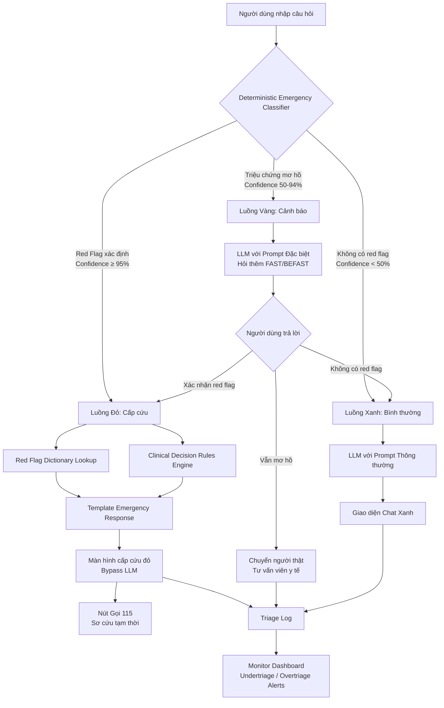

# demo.md — Demo kiến trúc dữ liệu

File này chứa sơ đồ Mermaid và mô tả ngắn cách hệ thống giảm rủi ro undertriage (T-01).

---

## 1. Sơ đồ cách hệ thống xử lý



---

## 2. Thành phần chính

| Thành phần | Nhận gì? | Làm gì? | Trả ra gì? |
|---|---|---|---|
| **Deterministic Emergency Classifier** | Câu hỏi người dùng (text) | Phân tích từ khóa red flag + quy tắc lâm sàng FAST/BEFAST + đánh giá confidence | Luồng Xanh / Vàng / Đỏ |
| **Red Flag Dictionary** | Từ khóa cần kiểm tra | Tra cứu danh sách triệu chứng cấp cứu từ Hướng dẫn Bộ Y tế | Danh sách red flag phát hiện + mức độ |
| **Clinical Decision Rules Engine** | Các triệu chứng phát hiện | Áp dụng quy tắc "Nếu A + B → Cấp cứu", "Nếu A hoặc B → Cảnh báo" | Quyết định luồng + confidence score |
| **LLM with Emergency Prompt** | Câu hỏi + ngữ cảnh luồng Vàng | Sinh câu hỏi lại FAST/BEFAST, cảnh báo nguy cơ | Câu trả lời hỏi thêm + cảnh báo vàng |
| **LLM with Standard Prompt** | Câu hỏi + ngữ cảnh luồng Xanh | Trả lời tư vấn thông thường theo phạm vi sàng lọc | Câu trả lời + disclaimer |
| **Emergency Template Renderer** | Kết quả luồng Đỏ | Render màn hình cấp cứu từ template có sẵn | HTML/UI màn hình đỏ |
| **Triage Log & Monitor** | Mọi input + phân loại + hành động | Lưu log, tính toán tỉ lệ undertriage/overtriage, gửi cảnh báo | Dashboard + alert |

---

## 3. Khi hệ thống gặp vấn đề

| Khi nào lỗi xảy ra? | Hệ thống làm gì? | Người dùng thấy gì? |
|---|---|---|
| **Nguồn chính thức không có dữ liệu** (Dictionary thiếu triệu chứng mới) | Classifier trả về "Không xác định" (confidence < 50%). Chuyển sang Luồng Vàng. | Màn hình cảnh báo vàng: "Triệu chứng của bạn cần được đánh giá thêm. Hãy trả lời thêm 2 câu hỏi hoặc gọi 115 nếu lo lắng." |
| **Nguồn bị lỗi hoặc quá chậm** (Dictionary timeout) | Bộ đếm thời gian (timeout 500ms) kích hoạt. Classifier mặc định chuyển Luồng Vàng để an toàn. | Màn hình cảnh báo vàng. Hệ thống không bao giờ để người dùng chờ mà không có phản hồi. |
| **Câu hỏi vượt phạm vi AI** (hỏi chẩn đoán, kê đơn) | Luồng Xanh nhưng LLM detect vượt phạm vi qua prompt rules. Từ chối và hướng dẫn sang người thật. | "Tôi không thể chẩn đoán/kê đơn. Hãy đặt lịch khám với bác sĩ chuyên khoa. [Nút đặt lịch]" |
| **Lỗi này lặp lại nhiều lần** (cùng một câu hỏi bị undertriage) | Monitor phát hiện pattern qua Triage Log. Gửi alert cho đội kỹ thuật + bác sĩ tư vấn. Tự động thêm từ khóa vào Dictionary. | Người dùng cuối không thấy gì khác biệt ngay, nhưng lần sau cùng câu hỏi sẽ được phân loại chính xác hơn. |

---

## 4. Chi tiết Deterministic Emergency Classifier

```text
┌─────────────────────────────────────────────┐
│  DETERMINISTIC EMERGENCY CLASSIFIER         │
├─────────────────────────────────────────────┤
│                                             │
│  Input: Câu hỏi người dùng (text)           │
│                                             │
│  Step 1: Keyword Matching                   │
│    - Tra Red Flag Dictionary                │
│    - FAST: Face/Arm/Speech/Time             │
│    - BEFAST: +Balance/Eyes                │
│    - Cấp cứu khác: khó thở, tím tái,      │
│      đau ngực, tự sát, hóc dị vật...      │
│                                             │
│  Step 2: Rule Engine                        │
│    - Nếu ≥2 dấu hiệu FAST → Luồng Đỏ      │
│    - Nếu 1 dấu hiệu FAST + ngữ cảnh cấp    │
│      cứu → Luồng Đỏ                       │
│    - Nếu 1 dấu hiệu FAST → Luồng Vàng     │
│    - Nếu từ khóa cấp cứu rõ ràng → Luồng  │
│      Đỏ                                   │
│    - Nếu không khớp → Luồng Xanh          │
│                                             │
│  Step 3: Confidence Scoring               │
│    - 95-100%: Luồng Đỏ (xác định)         │
│    - 50-94%:  Luồng Vàng (mơ hồ)          │
│    - 0-49%:   Luồng Xanh (bình thường)    │
│                                             │
│  Output: {flow, confidence, flags_found}  │
│                                             │
└─────────────────────────────────────────────┘
```

---

## 5. Kiểm tra nhanh

- [x] Sơ đồ không chỉ là "AI trả lời tốt hơn", mà có bước kiểm tra cụ thể (Deterministic Classifier trước LLM).
- [x] Có cách xử lý khi thiếu dữ liệu (Luồng Vàng: hỏi thêm, chuyển người thật).
- [x] Có cách chuyển sang người thật (Luồng Đỏ: Gọi 115; Luồng Vàng: Tư vấn viên y tế).
- [x] Có cách theo dõi để lần sau sửa tốt hơn (Triage Log + Monitor Dashboard + auto-update Dictionary).
